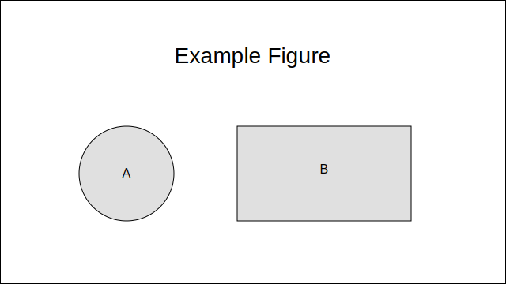

# บทนำ

นี่คือโปรเจ็กต์ตัวอย่างสำหรับทำหนังสือด้วย **Markdown** แล้วแปลงเป็น **LaTeX/PDF** ด้วย **Pandoc** และ **XeLaTeX** (รองรับภาษาไทยได้ดี)

- เขียนเนื้อหาในไฟล์ `.md` ภายใต้โฟลเดอร์ `book/chapters/`
- รูปภาพใส่ไว้ใน `book/figures/`
- รายการอ้างอิงใช้ BibTeX ใน `book/references.bib` แล้วอ้างด้วย `[@knuth1984texbook]`

ตัวอย่างรูป (ดูที่รูป {#fig:example}):  
{ width=60% }

ในเล่มนี้เราสามารถอ้างอิงงานวิจัยเช่น Transformer [@vaswani2017attention].
